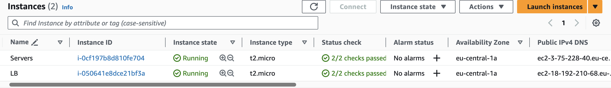
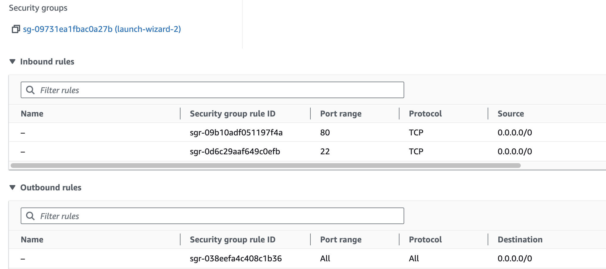

# projector-aws-ec2
Creates 2 EC2 instances: with Nginx 2 webservers and Nginx load balancer that routes requests between 2 web servers.
Each server returns a text 'server 1' and 'server 2'

# Set up
1. Launch 2 EC2 instances:


2. Configure security groups for inbound traffic:



3. Install docker and docker-compose on each instance:

```shell
sudo su
yum install -y docker
service docker start
curl -L https://github.com/docker/compose/releases/latest/download/docker-compose-$(uname -s)-$(uname -m) -o /usr/local/bin/docker-compose
chmod +x /usr/local/bin/docker-compose
```

4. Copy Nginx config and docker-compose files for web servers

```shell
scp -i web-server-key-pair.pem server-1.conf ec2-user@ec2-3-75-228-40.eu-central-1.compute.amazonaws.com:~/
scp -i web-server-key-pair.pem server-2.conf ec2-user@ec2-3-75-228-40.eu-central-1.compute.amazonaws.com:~/
scp -i web-server-key-pair.pem docker-compose.yml ec2-user@ec2-3-75-228-40.eu-central-1.compute.amazonaws.com:~/
```

5. Update [load balancer nginx config](./server-lb.conf) `upstream backend_servers` section
6. Copy Nginx config and docker-compose files for load balancer
```shell
scp -i web-server-key-pair.pem server-lb.conf ec2-user@ec2-18-192-210-68.eu-central-1.compute.amazonaws.com::~/
scp -i web-server-key-pair.pem docker-compose-lb.yml ec2-user@ec2-18-192-210-68.eu-central-1.compute.amazonaws.com:~/docker-compose.yml
```

5. Start up containers in both instances:

```shell
docker-compose up -d
```

6. Check that load balancer routes requests between 2 web servers:

```
curl http://ec2-18-192-210-68.eu-central-1.compute.amazonaws.com/data/
Server 2

curl http://ec2-18-192-210-68.eu-central-1.compute.amazonaws.com/data/
Server 1

curl http://ec2-18-192-210-68.eu-central-1.compute.amazonaws.com/data/
Server 2

curl http://ec2-18-192-210-68.eu-central-1.compute.amazonaws.com/data/
Server 1
```

7. Clean up AWS resources by stopping and terminating EC2 instances